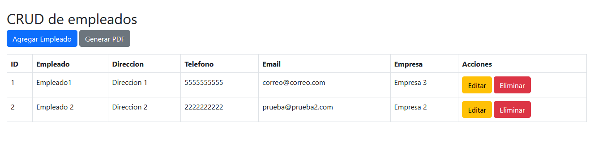

# Employee-crud
CRUD de empleados con Bootstrap, SweetAlert 2 y generación de PDFs

  
   
   
  <samp>
    Este proyecto es una aplicación de gestión de empleados que permite realizar operaciones de Creación, Lectura, Actualización y Eliminación (CRUD) de registros. Utiliza Bootstrap para el diseño responsivo, SweetAlert 2 para notificaciones y alertas interactivas, y pdfmake para la generación de reportes en PDF. El proyecto está construido siguiendo el patrón Modelo-Vista-Controlador (MVC).
  </samp>

## Características

- **CRUD Completo:** Gestiona registros de empleados con opciones para agregar, editar, eliminar (lógica) y visualizar.
- **Interfaz Responsiva:** Utiliza Bootstrap para garantizar una experiencia de usuario fluida en dispositivos de todos los tamaños.
- **Alertas Interactivas:** Implementa SweetAlert 2 para alertas personalizadas en operaciones como guardar, editar o eliminar registros.
- **Generación de PDFs:** Crea reportes personalizados en PDF usando pdfmake, ideal para exportar listas de empleados.
- **Diagrama E-R:** Incluye un diagrama Entidad-Relación en formato de imagen para entender la estructura de la base de datos.
- **Base de Datos:** Se proporciona la base de datos inicial con algunos registros básicos para facilitar la puesta en marcha.
- **Código Comentado:** Todo el código está extensivamente comentado para facilitar la comprensión y el mantenimiento del proyecto.

## Estructura del Proyecto
El proyecto está organizado siguiendo el patrón MVC para una clara separación de responsabilidades:

- **Modelo (Model):** Gestión de la lógica de la aplicación y la interacción con la base de datos.
- **Vista (View):** Presentación de la interfaz de usuario.
- **Controlador (Controller):** Manejo de la lógica de negocio y las solicitudes de usuario.

## Requisitos

- **Servidor Web** (Apache, Nginx, etc.)
- **PHP** (versión 7.4 o superior)
- **Base de Datos** (MySQL o compatible)

## Instalación

1. Clona el repositorio: `git clone https://github.com/AlexGFJ/Employee-crud.git`
2. Configura la base de datos y carga el archivo SQL incluido.
3. Configura el archivo de conexión a la base de datos.
4. Abre el proyecto en tu servidor local y accede a la aplicación a través de tu navegador.

## Contribuciones

Las contribuciones son bienvenidas. Por favor, realiza un fork del repositorio y envía un pull request con tus mejoras o correcciones.

  
   
   
  Hecho con :heart: usando GitHub Markdown

⭐️ From [AlexGFJ](https://github.com/AlexGFJ)
